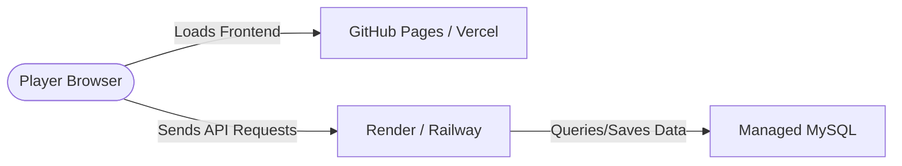

# Lichtfall (STI Adventures) - Web-Based Text Adventure Game Engine

A text-based narrative web adventure game built with a Django/MySQL backend and a static HTML/CSS/JS frontend.

---

## 🚀 How to Run Locally

To play the game on your computer, you need to run both the **Backend API** and the **Frontend Web Client**.

### 1. Backend Setup (Django & MySQL)

#### Prerequisites
* **Python 3.10+** installed on your system.
* **MySQL Server** (e.g., via [XAMPP](https://www.apachefriends.org/), Docker, or native installer).

#### Step-by-Step Instructions
1. **Create the Database:**
   * Open your MySQL management tool (like phpMyAdmin or MySQL Workbench).
   * Create a new database named `lichtfall_db_new`.
   * *(Optional)*: You can import the database schema using `documents/Database/TextWebBBasedGameEngi_3.sql`. However, Django migrations will create these tables automatically.

2. **Configure Database Connection:**
   * Open `lichtfall_backend/lichtfall_backend/settings.py`.
   * Find the `DATABASES` section and input your MySQL `PASSWORD` (e.g., if you use XAMPP, this is usually blank `""` or `"root"`):
     ```python
     DATABASES = {
         'default': {
             'ENGINE': 'django.db.backends.mysql',
             'NAME': 'lichtfall_db_new',
             'USER': 'root',
             'PASSWORD': 'YOUR_MYSQL_PASSWORD_HERE',
             'HOST': 'localhost',
             'PORT': '3306',
         }
     }
     ```

3. **Install Python Packages:**
   * Open a terminal in the root directory and install dependencies:
     ```bash
     pip install -r requirements.txt
     ```

4. **Run Migrations:**
   * Create and sync the database tables:
     ```bash
     cd lichtfall_backend
     python manage.py migrate
     ```

5. **Start Django Server:**
   * Start the backend development server:
     ```bash
     python manage.py runserver
     ```
   * The API will now be running at `http://127.0.0.1:8000/`.

> [!NOTE]
> The backend features **auto-seeding**. When you start the frontend and log in/play, the backend automatically seeds all the locations, story nodes, choices, and items if it detects the database is empty!

---

### 2. Frontend Setup (HTML/CSS/JS)

Because the frontend is static HTML, CSS, and JS, you must serve it over a local server to avoid CORS blocks and routing issues.

#### Option A: VS Code Live Server (Recommended)
1. Open the project in VS Code.
2. Install the **Live Server** extension.
3. Open `lichtfall_frontend/user-auth/login.html`.
4. Click the **Go Live** button in the bottom right corner of VS Code (usually runs on port `5500`).

#### Option B: Python Local Server
1. Open a new terminal in the workspace root.
2. Run Python's built-in server:
   ```bash
   cd lichtfall_frontend
   python -m http.server 8080
   ```
3. Open `http://localhost:8080/user-auth/login.html` in your browser.

---

## 🌐 How to Make It Public (Production Deployment)

To allow other players to access your game over the internet, you must deploy both the frontend and the backend to public cloud providers.



### Step 1: Deploy the Database
You need a MySQL database that is accessible online 24/7.
* **Options:** Use a free tier managed database from providers like **Aiven.io**, **Railway**, or **TiDB Cloud**.
* Save your new database credentials (host, database name, user, password, port).

### Step 2: Deploy the Backend (Django)
Deploy your `lichtfall_backend` directory using a Python hosting provider:
* **Recommended Free/Low-Cost Hosts:** [Render](https://render.com/) or [Railway](https://railway.app/).
* **Production Adjustments (`settings.py`):**
  1. Set `DEBUG = False`.
  2. Retrieve settings from Environment Variables instead of hardcoding:
     ```python
     import os
     SECRET_KEY = os.environ.get('SECRET_KEY', 'your-default-key')
     # Use database URL parsed configuration or environment variables for DATABASES
     ```
  3. Set `ALLOWED_HOSTS = ['your-backend-app-name.onrender.com']`.
  4. Update `CORS_ALLOWED_ORIGINS` to point to your deployed frontend:
     ```python
     CORS_ALLOWED_ORIGINS = [
         "https://your-github-username.github.io",
     ]
     ```

### Step 3: Link the Frontend to the Public Backend
Before hosting the frontend, update the API URLs to point to your new public backend URL.
1. Open `lichtfall_frontend/user-auth/src/js/auth.js` and edit the base URL:
   ```javascript
   const API_BASE_URL = "https://your-backend-app-name.onrender.com/api/auth";
   ```
2. Open `lichtfall_frontend/homepage/src/js/game.js` and edit the base URL:
   ```javascript
   const API_BASE_URL = "https://your-backend-app-name.onrender.com/api/game";
   ```

### Step 4: Deploy the Frontend (Static Hosting)
Since the frontend is static, you can host it for free:
* **Option A: GitHub Pages (Easiest)**
  1. Push your code repository to GitHub.
  2. Go to **Settings > Pages** in your repo.
  3. Under **Build and deployment**, select **Deploy from a branch**.
  4. Select the branch (e.g., `main`) and folder `/lichtfall_frontend` (or place frontend in a dedicated repository/branch).
* **Option B: Vercel / Netlify**
  1. Create a free account on Vercel or Netlify.
  2. Import your GitHub repository.
  3. Set the "Root Directory" to `lichtfall_frontend` and deploy.

Your game will now be live and accessible to anyone via the URL provided by your frontend host!